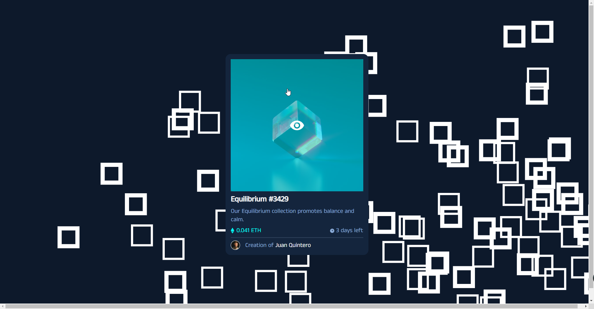

# Frontend Mentor - NFT preview card component solution

This is a solution to the [NFT preview card component challenge on Frontend Mentor](https://www.frontendmentor.io/challenges/nft-preview-card-component-SbdUL_w0U). Frontend Mentor challenges help you improve your coding skills by building realistic projects. 

## Table of contents

- [Overview](#overview)
  - [The challenge](#the-challenge)
  - [Screenshot](#screenshot)
  - [Links](#links)
- [My process](#my-process)
  - [Built with](#built-with)
  - [What I learned](#what-i-learned)
  - [Continued development](#continued-development)
  - [Useful resources](#useful-resources)
- [Author](#author)
- [Acknowledgments](#acknowledgments)

**Note: Delete this note and update the table of contents based on what sections you keep.**

## Overview


### The challenge

Users should be able to:

- View the optimal layout depending on their device's screen size
- See hover states for interactive elements

### Screenshot



### Links

- Live Site URL: [Add live site URL here](https://nft-preview-card-component-dun.vercel.app/)

## My process

### Built with

- Semantic HTML5 markup
- CSS custom properties
- Flexbox
- Mobile-first workflow
- Responsive Design
- HTML Canvas


### What I learned

This challenge was a great opportunity to learn about pseudo classes in CSS, responsive design and the posibilities of HTML Canvas to improve the interactive experience. For example, I used JavaScript to change the opacity of HTML Canvas when the user over the mouse over the card image.

```html
<h1>Some HTML code I'm proud of</h1>
```
```css
.proud-of-this-css {
  color: papayawhip;
}
```
```js
cardImage.addEventListener('mouseover', () => {
    canvas.style.opacity = 1;
    console.log("over")
})

cardImage.addEventListener('mouseout', () => {
    canvas.style.opacity = 0;
    console.log("out")
})
```

### Continued development

I hope to continue learning about HTML Canvas and its potential to create interactive website and also improve my CSS skills.


## Author

- Frontend Mentor - [@Corsarrior](https://www.frontendmentor.io/profile/corsarrior)
- Twitter - [@JuanQB94](https://www.twitter.com/JuanQB94)

